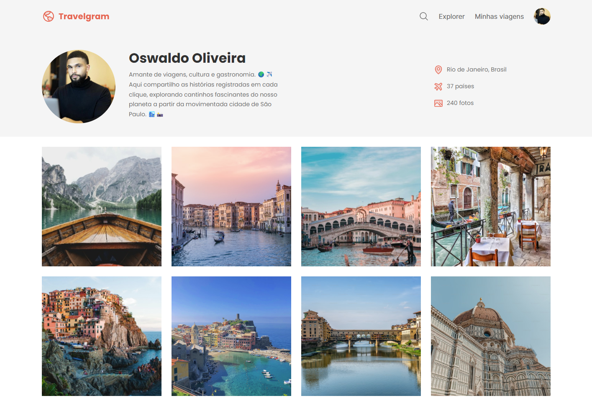

<!--- # "Can be a image or a gift from the project pages" -->

  

# Travelgram

This project is to learn HTML and CSS.

## Tech Stack

<!--- # "Verify icons availability here https://github.com/tandpfun/skill-icons" -->

